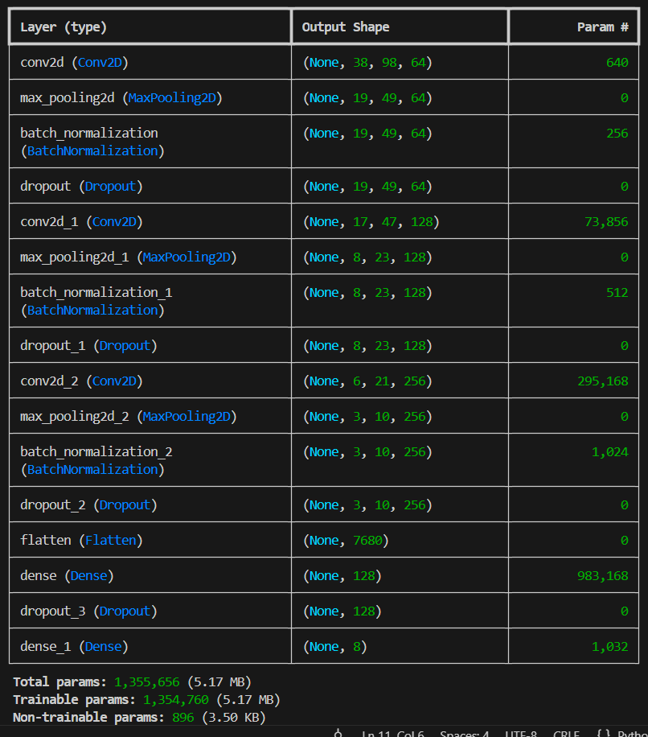

# Speech Emotion Recognition (SER)

## Overview
This project implements a Speech Emotion Recognition system using TensorFlow and Keras. It processes audio recordings of human speech, extracts Mel-Frequency Cepstral Coefficients (MFCCs) using `librosa`, and leverages a Convolutional Neural Network (CNN) to classify the speaker's emotion.

The model is trained to recognize 8 distinct emotions: Neutral, Calm, Happy, Sad, Angry, Fearful, Disgust, and Surprised.

## The "Audio as Image" Paradigm

At its core, raw audio is a one-dimensional time series—a single, long array of numbers representing air pressure changes over time. While neural networks can process 1D data, it is highly inefficient for extracting complex, high-level features like human emotion. 

To solve this, this project leverages a standard signal processing technique to transform the 1D audio into a 2D mathematical "image":

* **The Transformation:** Using a Fast Fourier Transform (FFT), the audio wave is broken down into its individual component frequencies. We then plot these frequencies on a 2D grid to create Mel-Frequency Cepstral Coefficients (MFCCs).
* **The Axes:** On this 2D grid, the X-axis represents Time, the Y-axis represents Frequency (Pitch), and the actual values inside the matrix represent Amplitude (Loudness). 
* **CNN Compatibility:** Because this 2D representation is structurally identical to a single-channel (grayscale) image, we can feed it directly into a standard image classification model. Just as a CNN learns to detect the physical edges and textures of objects in a photograph, it learns to detect the distinct visual "shapes" of human speech. For example, a sharp, angry shout creates distinct, jagged visual edges on the matrix, while a calm voice creates smooth, lower-frequency bands.

## Dataset
This project is built using the **RAVDESS** (Ryerson Audio-Visual Database of Emotional Speech and Song) dataset. 

1. Download the `Audio_Speech_Actors_01-24.zip` file from Kaggle or Zenodo.
2. Extract the folders (`Actor_01` through `Actor_24`) into a directory named `data/` within your project folder.
3. The emotion labels are embedded directly into the filenames (the third set of numbers in the dashed naming convention).

## Installation

Ensure you have Python 3.8+ installed. Install the required dependencies using pip:

```bash
pip install tensorflow librosa numpy scikit-learn matplotlib soundfile
```
*Note: If you are running this natively on Windows with a GPU, ensure you are using TensorFlow 2.10 or earlier, along with the corresponding CUDA and cuDNN versions.*

## Model Architecture
Because audio waveforms are 1D time-series data, this project converts them into 2D MFCC matrices, treating them essentially as images. This allows us to use a CNN architecture:
- **Feature Extraction:** 40 MFCCs over 100 time steps.
- **Convolutional Blocks:** Three sets of Conv2D and MaxPooling2D layers (64, 128, and 256 filters respectively).
- **Regularization:** Heavy use of BatchNormalization and Dropout (0.2 to 0.4) to prevent overfitting on the small dataset.
- **Classification:** Flattening layer followed by Dense layers, ending with a Softmax activation for the 8 emotion classes.



## Overfitting Prevention
**1. Data Augmentation**
To push accuracy past the standard baseline, the data pipeline includes optional audio augmentation capabilities. By injecting subtle white noise and applying pitch shifting to the raw audio before MFCC extraction, the dataset size is effectively tripled, drastically improving the model's ability to generalize.

**2. Batch Normalization**
Applied immediately after each convolutional block, Batch Normalization standardizes the inputs to the next layer for every mini-batch. This not only accelerates the training process by stabilizing the learning curve, but it also provides a slight regularization effect. By preventing internal activation values from shifting too drastically, it stops the model from overly relying on extreme acoustic anomalies that might be unique only to the training data.

**3. Dropout**
To combat the network's tendency to memorize the specific voices of the actors in the relatively small RAVDESS dataset, Dropout layers are strategically placed throughout the architecture. By randomly deactivating a set percentage of neurons (ranging from 20% in the convolutional blocks to 30% in the dense layers) during each training step, the network cannot rely on any single "pixel" of the spectrogram. This forces the model to learn robust, generalized patterns of emotion rather than memorizing the training files.
